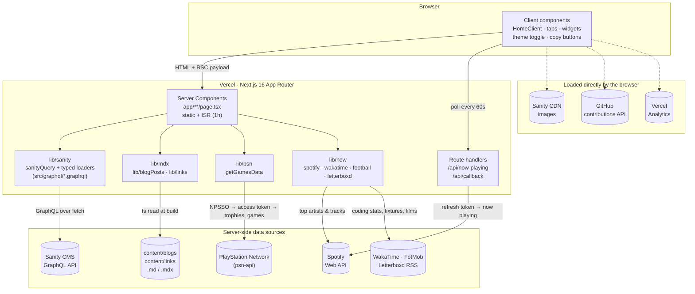

# Portfolio V5

Personal portfolio and blog of Prathamesh Mali, live at [pratham82.in](https://www.pratham82.in).

- Backend repo: [portfolio-api](https://github.com/Pratham82/portfolio-api) (Sanity Studio)
- [Portfolio API GraphQL URL](https://sfjfod25.api.sanity.io/v2024-01-01/graphql/production/default)

## Tech Stack

| Layer | Tools |
|-------|-------|
| Framework | Next.js 16 (App Router, React Server Components, ISR) |
| UI | React 19, Tailwind CSS 4, Motion, Phosphor Icons |
| Content | Sanity CMS (GraphQL), local MDX with `next-mdx-remote` |
| Integrations | Spotify Web API, PlayStation Network (`psn-api`), WakaTime, FotMob, Letterboxd, GitHub contributions, Vercel Analytics |
| Tooling | TypeScript 6, ESLint 9, Prettier, Husky, Playwright |
| Hosting | Vercel (Node 24) |

## Architecture

The main rules:

- **The browser never talks to Sanity's API.** Pages fetch from Sanity on the server, at build time and then again at most once an hour through ISR. An e2e test checks this.
- **Local MDX** in `content/` is read from disk and compiled to React on the server. The browser gets finished HTML.
- **Spotify credentials stay on the server.** The browser calls `/api/now-playing`, and that route handler talks to Spotify.
- **The PSN token stays on the server.** `/games` and `/home` load PlayStation data with `PSN_NPSSO` at build time and then at most once an hour through ISR. If the token is missing or expired, the Games section shows only the curated favourites and the build still passes. An e2e test checks that the browser never calls PSN.
- **The Now page widgets load on the server too.** Spotify top items, WakaTime, FotMob and Letterboxd are fetched with ISR; a widget whose source fails is left out.
- **Client components** only handle interactivity: tabs, keyboard shortcuts, the theme, animations, widgets and the code copy buttons.

## Documentation

| Doc | What's inside |
|-----|---------------|
| [Architecture](docs/architecture.md) | Request lifecycle (ISR), server vs client components, routes, project structure |
| [Getting started](docs/getting-started.md) | Local setup, environment variables, scripts |
| [Spotify setup](docs/spotify.md) | Getting the Spotify client credentials and refresh token for the now-playing widget |
| [Now page setup](docs/now.md) | The Now page widgets (Spotify, WakaTime, football, Letterboxd), their keys and endpoints, and the header clock |
| [PlayStation setup](docs/psn.md) | Getting and renewing the PSN token (NPSSO) for the Games section, plus the PSN auth flow and endpoints it calls |
| [Testing & CI](docs/testing.md) | Playwright tests, visual baselines, CI |
| [Writing content](docs/writing-content.md) | Adding blog posts and links |
