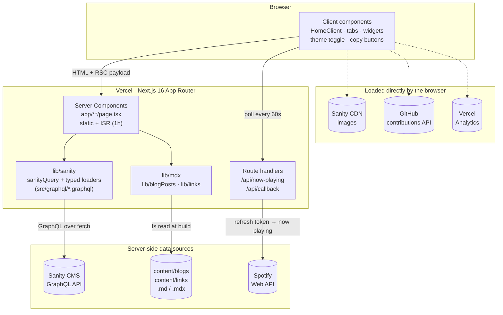
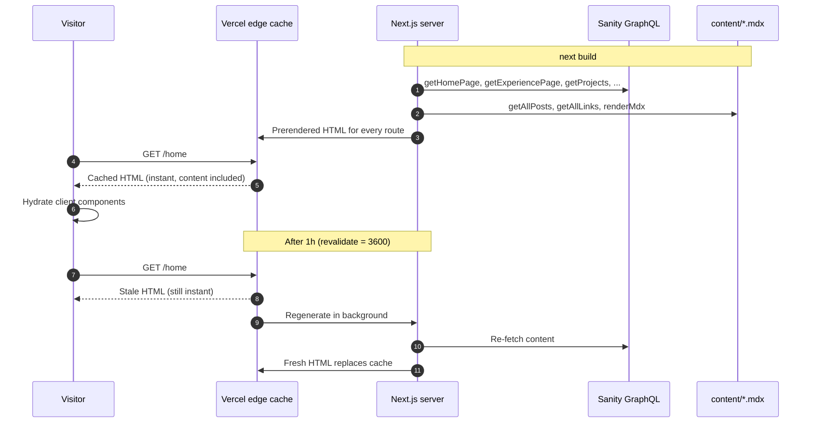
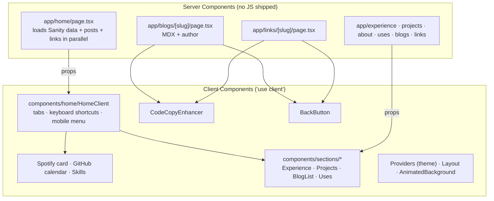

# Portfolio V5

[](https://deepwiki.com/Pratham82/portfolio-v5)

Personal portfolio and blog of Prathamesh Mali, live at [pratham82.in](https://www.pratham82.in).

- Backend repo: [portfolio-api](https://github.com/Pratham82/portfolio-api) (Sanity Studio)
- [Portfolio API GraphQL URL](https://sfjfod25.api.sanity.io/v2024-01-01/graphql/production/default)

## Tech Stack

| Layer | Tools |
|-------|-------|
| Framework | Next.js 16 (App Router, React Server Components, ISR) |
| UI | React 19, Tailwind CSS 4, Motion, Phosphor Icons |
| Content | Sanity CMS (GraphQL), local MDX with `next-mdx-remote` |
| Integrations | Spotify Web API, GitHub contributions, Vercel Analytics |
| Tooling | TypeScript 6, ESLint 9, Prettier, Husky, Playwright |
| Hosting | Vercel (Node 24) |

## Architecture

### How the pieces connect



The main rules:

- **The browser never talks to Sanity's API.** Pages fetch from Sanity on the server, at build time and then again at most once an hour through ISR. An e2e test checks this.
- **Local MDX** in `content/` is read from disk and compiled to React on the server. The browser gets finished HTML.
- **Spotify credentials stay on the server.** The browser calls `/api/now-playing`, and that route handler talks to Spotify.
- **Client components** only handle interactivity: tabs, keyboard shortcuts, the theme, animations, widgets and the code copy buttons.

### Request lifecycle



If Sanity is down during a rebuild, visitors keep getting the last good page.

### Server vs client rendering



The `components/sections/*` views are shared: each one renders both on its own route (like `/projects`) and inside the matching `/home` tab.

## Routes

| Route | Rendering | Data |
|-------|-----------|------|
| `/` | Redirects (308) to `/home` | `next.config.js` |
| `/home` | Static + ISR (1h) | Sanity + local posts/links |
| `/experience`, `/about` | Static + ISR (1h) | Sanity work experience |
| `/projects` | Static + ISR (1h) | Sanity projects |
| `/blogs` | Static | `content/blogs` |
| `/blogs/[slug]` | Static + ISR (1h) | MDX + Sanity author |
| `/links`, `/links/[slug]` | Static | `content/links` |
| `/uses`, `/guides/ai-guide` | Static | Hard-coded content |
| `/api/now-playing` | Dynamic | Spotify |
| `/api/callback` | Dynamic | One-time Spotify OAuth helper |

## Project Structure

```
app/                  Routes (App Router), layout, API route handlers
components/
  home/               HomeClient: interactive home page
  sections/           Views shared by routes and home tabs
  guides/             The AI engineering guide
lib/
  sanity/             Server-side Sanity client + typed loaders
  mdx.ts              Server MDX rendering (rehype highlight + autolink)
  blogPosts.ts        content/blogs parser
  links.ts            content/links parser
src/
  graphql/queries/    .graphql documents (loaded via graphql-tag/loader)
  hooks/              useTabs, useNowPlaying
  data/ · utils/      Static data and helpers
content/              Local blog posts and link collections (.md / .mdx)
interface/            TypeScript types
e2e/                  Playwright tests + screenshot baselines
styles/globals.css    Tailwind 4 config (@theme, dark variant) + fonts
```

## Getting Started

Requires **Node 24** (see `.nvmrc`).

```bash
npm install
cp .env.example .env.local   # then fill in the values
npm run dev                  # http://localhost:3000
```

### Environment variables

| Variable | Used by | Notes |
|----------|---------|-------|
| `NEXT_PUBLIC_PORTFOLIO_GRAPHQL_ENDPOINT` | `lib/sanity` (server) | Required: the build fails without it |
| `SPOTIFY_CLIENT_ID` | `/api/now-playing` | Server-only |
| `SPOTIFY_CLIENT_SECRET` | `/api/now-playing` | Server-only |
| `SPOTIFY_REFRESH_TOKEN` | `/api/now-playing` | Get one using `/api/callback` |

## Scripts

| Command | Purpose |
|---------|---------|
| `npm run dev` | Dev server |
| `npm run build` / `npm start` | Production build / serve |
| `npm run lint` / `npm run lint:fix` | ESLint |
| `npm run typecheck` | `tsc --noEmit` |
| `npm run test:e2e` | Build, start on port 3100, run Playwright |
| `npm test` | Typecheck + e2e |

## Testing & CI

- **Playwright** (`e2e/`) checks that every route loads with no console errors. It also tests the interactive parts: tabs, keyboard shortcuts, back navigation, theme toggle, code copy, the projects filter, the mobile menu and the API.
- **Visual regression**: every route has a screenshot in light and dark mode. The baselines are macOS-specific, so they run locally. After an intentional UI change, update them with `npx playwright test --update-snapshots=all`.
- **Pre-commit** (Husky): lint + typecheck.
- **GitHub Actions** (`.github/workflows/ci.yml`): lint, typecheck and Playwright on pushes and PRs to `master`, `main` and `dev`. Needs the `NEXT_PUBLIC_PORTFOLIO_GRAPHQL_ENDPOINT` repository secret.

## Writing Content

Add a `.md` or `.mdx` file to `content/blogs/` or `content/links/`. It's picked up at build time.

```md
---
title: My Post
date: 2025-01-01
description: Short summary
tags: [javascript, react]
author: pratham82
---
```

- Images: put files under `public/content/` and reference them as `/content/...`.
- Code blocks get syntax highlighting (`night-owl` theme) and a Copy button.
