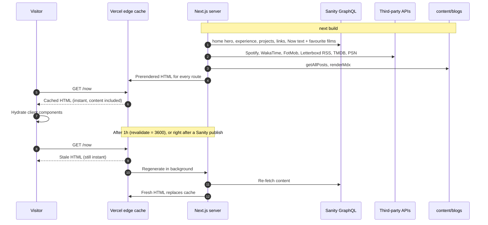
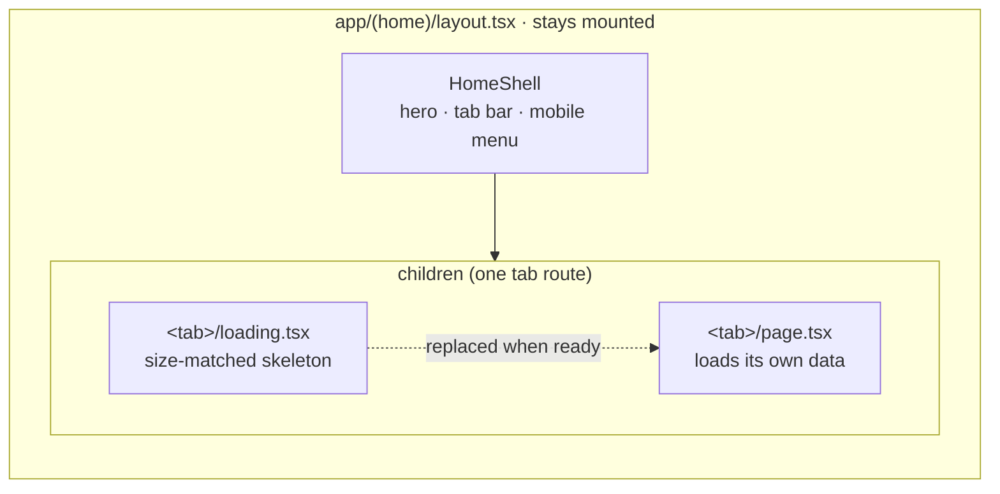
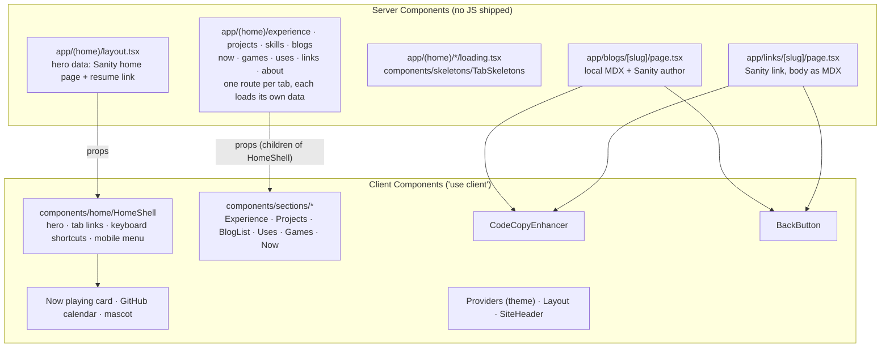

# Architecture

This page goes into detail on how the site is built. For the high-level diagram of how the pieces connect, see the [README](../README.md#architecture).

## Request lifecycle



If Sanity or a third-party API is down during a rebuild, visitors keep getting the last good page. A Now widget whose source fails is left out rather than failing the page.

### Publishing from Sanity

Publishing doesn't wait for the hour. A Sanity webhook POSTs to `/api/revalidate`, which checks the `sanity-webhook-signature` header against `SANITY_REVALIDATE_SECRET` and expires the `sanity` cache tag that every Sanity fetch carries (`lib/sanity/client.ts`). The next visit to any Sanity-backed page then re-renders with fresh content. This is how the Now text, the favourite films, links, projects and the home hero change without a deploy.

Webhook setup (sanity.io/manage → API → Webhooks):

- URL: `https://www.pratham82.in/api/revalidate` (use `www`: the bare domain redirects, and webhooks may not follow it), method POST
- Dataset `production`; trigger on create, update and delete; the filter can be left empty; drafts off
- Secret: the same value as `SANITY_REVALIDATE_SECRET` in Vercel

### In development

`next dev` renders every request on demand: nothing is prerendered or prefetched, and the Now widgets call their APIs each time. `sanityQuery` also skips the fetch cache in development (`revalidate: 0`), because the publish webhook can't reach `localhost`, so Studio edits show up on the next reload. Expect tab switches of about a second locally and about 50 ms in production. To check real performance, run `npm run build && npm start`.

## Home tabs and navigation



- **Every tab is a route** in the `app/(home)` route group: Work is `/experience`, `/projects`, `/skills` and `/blogs`, and Personal is `/now`, `/games`, `/uses`, `/links` and `/about`. `/` and `/home` render Experience (`/home` sets a canonical of `/`).
- **One source of truth.** `interface/home.interface.ts` defines the tabs, their groups (`HOME_TAB_GROUPS`), their URLs (`HOME_TAB_HREF`) and `getTabFromPath()`.
- **The URL decides the selected tab.** `src/hooks/useTabs.ts` reads `usePathname()`. Tabs and mobile menu items are `<Link>`s (the tabs use `scroll={false}`), so a tab can be shared, opened in a new tab, refreshed, and reached with back and forward.
- **Switching group** restores the tab last open in that group. **Keyboard shortcuts** (`e`/`1`, `p`/`2`, `b`/`3`, `s`) push URLs and are ignored while typing.
- **The layout stays mounted**, so the hero, mascot and calendar don't reload on a tab switch. Only the slot below the tab bar changes.
- **Loading states.** Each tab has a `loading.tsx` that renders its skeleton from `components/skeletons/TabSkeletons.tsx`. Each skeleton reuses its tab's wrappers, row heights and grid columns, so it takes the same space at every width. In production, Next.js prefetches the visible tab links, so the skeleton rarely shows. Update the matching skeleton when a tab's layout changes.
- **Old links** like `/home?from=blog` and `/home?from=links` redirect (308) to `/blogs` and `/links` (`next.config.js`). The blog and link back buttons go straight to `/blogs` and `/links`.

## Server vs client rendering



## Routes

All routes in `app/(home)` inherit `revalidate = 3600` from the layout, because the hero comes from Sanity.

| Route | Rendering | Data |
|-------|-----------|------|
| `/`, `/home` | Static + ISR (1h) | Hero + Experience tab. `/home` is the old landing URL; it renders the same view with a canonical of `/` |
| `/home?from=blog\|links` | Redirects (308) to `/blogs` / `/links` | `next.config.js` (old back-button links) |
| `/experience` | Static + ISR (1h) | Resume PDF + Sanity company logos |
| `/projects` | Static + ISR (1h) | Sanity projects |
| `/skills` | Static + ISR (1h) | `src/data/skils-data.ts` |
| `/blogs` | Static + ISR (1h) | `content/blogs` |
| `/blogs/[slug]` | Static + ISR (1h) | Local MDX + Sanity author; `dynamicParams = false` |
| `/now` | Static + ISR (1h) | Sanity `nowPage` (text + favourite films) + Spotify, WakaTime, FotMob, Letterboxd RSS, TMDB (`lib/now.ts`) |
| `/games` | Static + ISR (1h) | PSN (`lib/psn.ts`) + `src/data/games.json` |
| `/uses` | Static + ISR (1h) | `src/data/uses.json` |
| `/links` | Static + ISR (1h) | Sanity `link` documents |
| `/links/[slug]` | Static + ISR (1h) | Sanity `link`, body rendered as MDX; `dynamicParams = true`, so links published after a deploy render on first visit |
| `/about` | Static + ISR (1h) | Hard-coded social cards (`components/AboutMe.tsx`) |
| `/guides/ai-guide` | Static | Hard-coded content |
| `/api/now-playing` | Dynamic | Spotify (polled by the hero card every 60s) |
| `/api/callback` | Dynamic | One-time Spotify OAuth helper |
| `/api/revalidate` | Dynamic | Sanity publish webhook (expires the `sanity` cache tag) |

## Where content lives

| Content | Source | Edited in | Live without a deploy? |
|---------|--------|-----------|------------------------|
| Home hero (title, intro, location), projects, company logos, resume link | Sanity | Studio | Yes (webhook) |
| Now text | Sanity `nowPage.body` (markdown rendered as MDX) | Studio → Now | Yes (webhook) |
| Favourite films (top 4) | Sanity `nowPage.favouriteFilms`; posters looked up on TMDB | Studio → Now | Yes (webhook) |
| Links | Sanity `link` documents | Studio → Links | Yes (webhook) |
| Work experience | Resume PDF (Sanity resume link) | The resume | Within a day (`RESUME_REVALIDATE`) |
| Blogs | `content/blogs/*.md(x)` | The repo | No |
| Skills, Uses, curated games | `src/data/*` | The repo | No |
| Now widgets, games, recently watched | Spotify, WakaTime, FotMob, PSN, Letterboxd RSS | Those services | Within an hour (ISR) |

The Studio lives in the [portfolio-api](https://github.com/Pratham82/portfolio-api) repo. After changing a schema there, run `npm run deploy-graphql` (the site reads the GraphQL API) and `npm run deploy` (the hosted Studio).

## Project structure

```
app/
  (home)/             Home tabs: layout (hero + tab bar), one folder per tab
                      with page.tsx + loading.tsx, plus / and /home
  blogs/[slug]/       Blog post pages (local MDX)
  links/[slug]/       Link pages (Sanity)
  guides/             The AI engineering guide
  api/                now-playing, callback, revalidate
components/
  home/HomeShell.tsx  Hero, tab bar, mobile menu
  sections/           The tab views (Experience, Projects, BlogList, Now, ...)
  now/                Now widgets: OnRepeat, CodingStats, Football,
                      FavouriteFilms, Movies
  skeletons/          Size-matched loading skeleton per tab
  ui/                 shadcn/ui primitives + hover-list, hero-washes
lib/
  sanity/             Server-side Sanity client + typed loaders
  now.ts              Now text + every Now widget loader
  favouriteFilms.ts   Top 4 from Sanity, posters from TMDB
  letterboxd.ts       Recently watched from the Letterboxd RSS feed
  spotify.ts · wakatime.ts · football.ts · psn.ts · resume.ts
  mdx.ts              Server MDX rendering (rehype highlight + autolink)
  blogPosts.ts        content/blogs parser
  links.ts            Sanity link loader (body rendered as MDX)
src/
  graphql/queries/    .graphql documents (loaded via graphql-tag/loader)
  hooks/              useTabs (URL-driven tabs), useNowPlaying
  data/ · utils/      Static data and helpers
content/              Local blog posts (.md / .mdx) and their images
interface/            TypeScript types (home tabs live in home.interface.ts)
e2e/                  Playwright tests, fixtures, screenshot baselines
styles/globals.css    Tailwind 4 config (@theme, dark variant) + fonts
```
