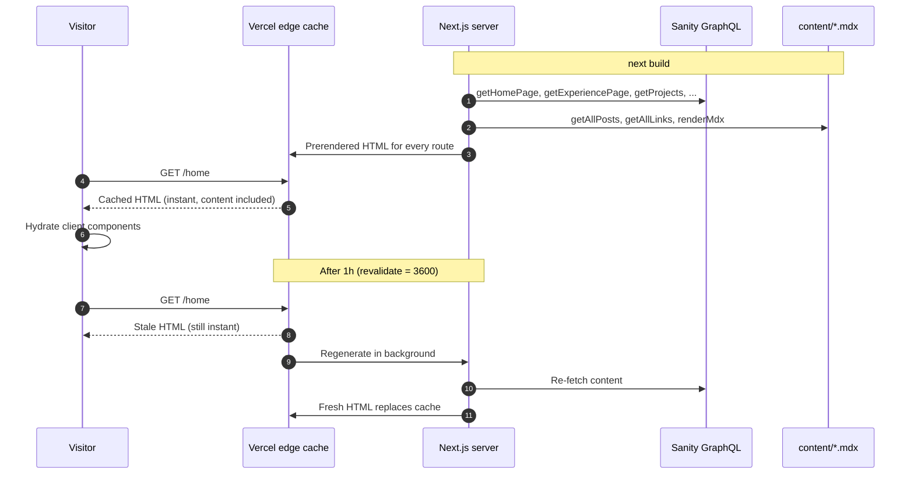
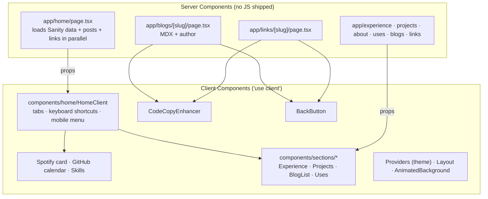

# Architecture

This page goes into detail on how the site is built. For the high-level diagram of how the pieces connect, see the [README](../README.md#architecture).

## Request lifecycle



If Sanity is down during a rebuild, visitors keep getting the last good page.

## Server vs client rendering



The `components/sections/*` views are shared: each one renders both on its own route (like `/projects`) and inside the matching `/home` tab.

## Routes

| Route | Rendering | Data |
|-------|-----------|------|
| `/` | Redirects (308) to `/home` | `next.config.js` |
| `/home` | Static + ISR (1h) | Sanity + local posts/links |
| `/experience`, `/about` | Static + ISR (1h) | Sanity work experience |
| `/projects` | Static + ISR (1h) | Sanity projects |
| `/blogs` | Static | `content/blogs` |
| `/blogs/[slug]` | Static + ISR (1h) | MDX + Sanity author |
| `/links`, `/links/[slug]` | Static | `content/links` |
| `/uses`, `/guides/ai-guide` | Static | Hard-coded content |
| `/api/now-playing` | Dynamic | Spotify |
| `/api/callback` | Dynamic | One-time Spotify OAuth helper |

## Project structure

```
app/                  Routes (App Router), layout, API route handlers
components/
  home/               HomeClient: interactive home page
  sections/           Views shared by routes and home tabs
  guides/             The AI engineering guide
lib/
  sanity/             Server-side Sanity client + typed loaders
  mdx.ts              Server MDX rendering (rehype highlight + autolink)
  blogPosts.ts        content/blogs parser
  links.ts            content/links parser
src/
  graphql/queries/    .graphql documents (loaded via graphql-tag/loader)
  hooks/              useTabs, useNowPlaying
  data/ · utils/      Static data and helpers
content/              Local blog posts and link collections (.md / .mdx)
interface/            TypeScript types
e2e/                  Playwright tests + screenshot baselines
styles/globals.css    Tailwind 4 config (@theme, dark variant) + fonts
```
